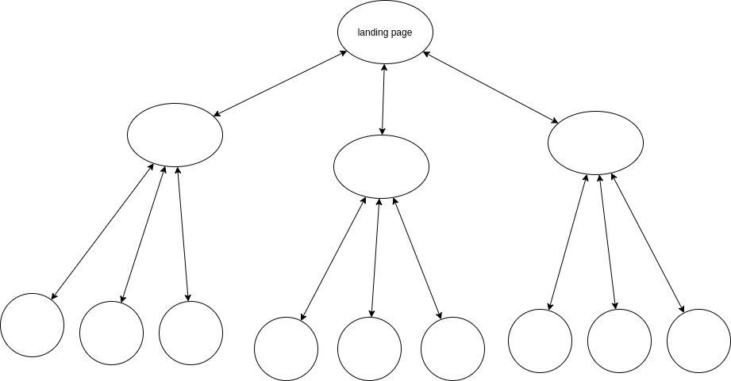

# seo_overview

## Terms

- __Search Engine (esp Google) (SE)__: a search engine
- __internal link__: a link to your a page on your another page
- __external link__: a link to another webpage on your web page
- __backlink__: a link, that is put on other website, to your web page
- __seed keywords__: a keyword to find/discouver your target keyword that your audience uses (like the first input to put in keyword planning then you find the sweet-spot keyword, and that's why it is called 'seed')
  - seed keyword is convereted to keyword that audience uses
- __short-tail keywords__: 1 - 2 words & highe competitive & hard to identity user intents
  - 30 of keyword search consists of this short-tail keywords
  - lower conversion rate because hard to identify user intent 
- __long-tail keywords__: 3 - 5 or even more words & lower competitive & easy to identity user intents
  - 70% of keyword search consists of this long-tail keywords
  - higher conversion rate because of easy to identify user intent
- __PageRank__: an algorithm to calculate a value of each web page as a score then decide its rank on the SERP.
- __RankBrain__: an AI/ML to update the rank of SERPs. for example, if the lower ranked page provide more better content than the higher ranked page, it switches the rank.
- __Click Through Rate (CTR)___: the percentage of people who click on your ad after seeing your ad 
- __Site Authority__: a score (0 - 100) about how well a specific page ranks in the SERP. (developed by Moz)
- __Link Equity (Link Juice)__: a value that is passed from one page to another, and the value is one of ranking factors. 
  - also, it can be understood as how the flow of a page's ranking power passes from one link to another. If a very authoritative page includes a followed link to a smaller site's article, it can be interpreted as a vote of confidence for the linked page, passing a certain amount of authority via that followed link.
  - if you get a backlink from famouse website, you get higher link equity and your site tend to be get higher rank. although there are a lot of other ranking factors.
  - Link Equity is determined by the facts like relevancy between one page and another, the site (put the link) is authoritative (e.g., famouse), is the link is followed, and so on. check [this](https://moz.com/learn/seo/what-is-link-equity) for more detail.
  - __cornerstone content__: an aggregated/summary page for other several detail pages

here are important concepts of SEO

## Backlinks

### Why

generally, backlinks are good for SEO since it is a proof that other website trusts you, but it might affect differently base on the type of backlinks. for example, if famouse website has backlink to your web page, it would affect your SEO positively. on the other hands, if bad website put backlink to your web page, it might affect SEO negatively.

#### followed

the backlink must be followed otherwise, you don't get the link equity. (e.g., no follow attribute of the link)

#### diversity of Domains / Types

- How diverse the links come from (e.g., a lot of different domains or its type of website)
- higher diverse, higher ranks

#### Relevance

- How relevant the linking page is to the linked page

#### How natural anchor text is

- overly keyword focused anchor text is not good

#### # of links on your page

- higher the number of outgoing links on a page there are, the less value each of those links is worth.

#### the link from bad site hurts you!!

- use this tool if you have a problem of this: here

- if your website is linked from low-quality, spammy website, this isn't a good signal to Google.

## Internal Links

### Why

1. helps SE find the page easily since links is a core of discovering a page
2. useful to spread link equity.
  - for example, if page (A) gets backlink from another domain which means that the page A receive the link equity. then, if the Page A has internal links to another page (B) (in the same domain), the link equity is passed to the page B. then it also boosts SEO ranking for the page B.
  - therefore, each page should have internal links to all other pages directly or indirectly so that link quity is distributed to all the page in your website. the amount of value that is distributed depends on the position where the link is put. if the internal link is put at the footer less value is passed to the page and if the internal link is put at the main content, the more value is passed to the page.
3. helps crawler establish site architecture 
4. helps Google understand what the page is about by checking the surrounding text and internal anchor text.

### Refs

  - [internal-link](https://moz.com/learn/seo/internal-link)
  - [link position](https://moz.com/blog/the-anatomy-of-a-link#link-position)

## Site Architecture 

it is important to create your site architecture like this:

- this is the minimum amount of links possible.
- you can have more links for each page.
- all pages are somehow connected by internal links to spread link equity.
- use internal links more to the more important page so that the crawler can understand which page is more important.

## Url

### Why

a minor ranking signal, but the users less likely to click the weird URL (since it is spammy)

### How

1. use clear name path (don't use cryptic/hash name)
2. use logical url structure (subdirectory)
  - don't use date-base URL if your content is sensitive about time
  - remove unnecessary/duplicated name (e.g., /categories/category-car/car1 => /cars/volvo)
  - use only (-) but other special chars like (_), (+), ( )
  - always use lower-case (not Camel-case, Upper-Case)
3. don't ever change/update the url already in use. this affect all of traffic to the page.

## HTML 

define the following tags for seo:

1. (head) meta content type: <meta http-equiv="Content-Type" content="text/html; charset=utf-8" /> 
2. (head) title: <title>
3. (head) description: <meta name="description" content="...">
  
4. (body) image: 
  - filename
  - alt text
  - optimize images (e.g., change the image based on the screen size so that you don't need to load a huge image for small screen)
  - optimize images (e.g., right formats with WebP, png, jpeg, svg)
5. proper formats: (hX, bullet, bold, and so on)
  
  
## Ranking Signals
  
### Top 3 Signals
  
1. links to your website: backlinks from famous website
2. on-page content: provide high quality content that fulfills a searcher's intent
3. RankBrain: automatically update the rank based on the above signals.
  * engagement metrics: how hte users interact with your site from search results.
    - clicks: how many people click your link on SERPs.
    - time on page (the percentage of all website sessions where users viewed only one page)
    - pogo-sticking (clicking on an organic result and then quickly returning to the SERP to choose anotehr result.
  
based on thoes result, RankBrain decline/promote your page
  
### Other Signals
  
- link equity by backlink
  
  
## Check List
  
### Indexing

LINKS are primary way the crawlers follow to the other pages!!!

- [ ] DON'T let your internal search result pages be crawled by Google.

- [ ] DO allow Crawler to access external resources (CSS, JS)

- [ ] DO allow your web server have enough capacity to handle a volume of crawl request for resources.

- [ ] DO generate/create sitemap and submit to Google. (you can automate this with [here](https://developers.google.com/webmaster-tools/search-console-api-original/v3/sitemaps))

- [ ] DON'T have Crawler to index 404 page, internal search result page. create noindex robots meta-tag)

- [ ] DO provide proper navigation to every detail page WITHOUT using search box.

  - Crawler can't use search box. so you should provide proper navigation without search box in order for users to go every detail page.

  - implement proper internal links to pages which you want those to be indexed.

### HTML

- [ ] DO specify encoding for your document at the top of your html tag.

#### Titling

- [ ] <title> should be in <head>

- [ ] each page should have accurate & proper title name in <title>

- [ ] title should be brief, but descriptive.

    - too long or less relevant title might be cut off.
    - google may show different titles depending on the user's query or device used for searching

- [ ] DON'T choose a title that has no relation to the content on the page

- [ ] DON'T use default or vague title like "Untitled" or "New Page1"

- [ ] DON'T set a single title for all pages

#### Description Meta Tag

- [ ] create <meta name="description"> for the description of <title> in each page.

- [ ] a sentence or two or even a short paragraph.

- [ ] in <head> tag

  - it might use them as snippets for your page on search results

- [ ] DON'T use generic description (i.e., too vague)

- [ ] DON'T fill the description with only keywords. (i.e., must be sentences)

- [ ] DON'T just copy of content of a blog to description meta tag.

- [ ] DON'T use single description for all of your pages in your site.

- [ ] DO summary & unique description of the page/blog

#### Heading Tags (e.g., h1, h2, h3, h4)

- [ ] DO like writing an outline for large paper, and extract main points and sub-points of the content.

- [ ] DO use heading tags for main/sub-main points

- [ ] DO use heading number rationally & naturally

  - e.g., h1 -> h3 = NO, h1 -> h2 -> h3 = OK.

- [ ] DON'T use too many headings on a page.

- [ ] DON'T make headings too long

- [ ] DON'T use headings for styling text or other purpose. only for representing the main/sub-main idea.

#### Structured Data Markup

- [ ] DO create this to make your link more user-friendly and rich.

#### URL

- [ ] DO add both www and non-www to GSC since Google consider that both are different. 

- [ ] DO create url with meaningful & user-friendly words

- [ ] DON'T include unrecognizable (e.g., cryptic or hashed). this might intimidate the visitors.

- [ ] DO make url structure simple.

- [ ] DON'T use generic page names like 'page1.html'

- [ ] DON'T USE EXCESSIVE KEYWORDS LIKE "baseball-cards-baseball-cards-baseballcards.html"
  
- [ ] DON'T update/change the url once it is already in use.

#### Directory Structure (of your website project)

- [ ] DON'T have deep nesteing of subdirectories like "../dir1/dir2/dir3/dir4..../page.html"

- [ ] DON'T have multiple urls to a single page.

- [ ] DON'T make the visitor access to the same content from different subdomains.

  -> sub.domain.com/page.html and domain.com/page.html point to the same content. who does that?

#### Navigation

- [ ] DO guide the users from general page (home) to specific content in easy way and provide its proper navigation.

- [ ] DO create categories/sub-categories if you have a lot of the detail pages.

- [ ] DO use breadcrumb

  - also this allow Google to create the breadcrumb on the link to your page on search result

  - use structured data

- [ ] DON'T create complex webs of navigation links (e.g., each page has a link to each other)

- [ ] DON'T create very long navigation (e.g., in order to get a detail page, it takes 20 clicks from home page)

- [ ] DO use text for navigation. this make Crawler easy to search and understand the site. 

  - use an anchor tag with href

- [ ] DON'T have a navigation based on entirely on images, or animations.

- [ ] DO generate navigation menu at the initial loading time, not when a user click something or any user interaction if you use js to generate navigation menu.

    - this is because it makes difficult for Crawler to find/index page using the navigation menu.

- [ ] DON'T make your navigational page become out of date with broken links.

#### Rich Media

- [ ] DO provide alternative text for each rich media since some device with low bandwidth connections, cannot see the rich media so provide the alternative.

- [ ] DO only use rich media only where it is needed. Google prefer you to use HTML for content and navigation

- [ ] DO organize your detail pages using categories or something.

- [ ] DO create 404 pages.

- [ ] DON'T provide inconsistent design for 404 pages. it must be consistent with the rest of your website.

#### Contents

THE MOST IMPORTANT FACTOR FOR SEO: CONTENT!!!!!

- [ ] word-of-mouth marketing (i.e., your website got reputation by users and consumers interaction not ads) helps build the good reputation on your website/pages.

- [ ] include BOTH technical jargon (only professionals know) and general words (everyone knows) to show on search result on both type of people.  

  - use keyword planner

- [ ] DO write your content simply & easy to understand for the users.

- [ ] DON'T embed text in images and video for textual content since users can't copy and paste and search engines can't read it.

- [ ] DO organize your content logically.

- [ ] DON'T insert numerous unnecessary keywords aimed at search engines but are annoying or nonsensical to users. 

#### Ads on Content

- [ ] there is a standard how to display ads on your content. check [this](https://www.betterads.org/)

- [ ] also there is review tool from google. check [this](https://www.google.com/webmasters/tools/ad-experience-unverified?hl=en).

#### Links

BEST: use MEANINGFUL_&_DESCRIPTIVE_LINK_TEXT in the anchor tag as text

- [ ] DON'T create generic anchor text like "page", "article", "click here"

- [ ] DO create anchor text in short but descriptive with a few words or a short phrase.

- [ ] DO make easy for users to distinguish between regular text and the anchor text.

#### Comments

- [ ] DO protect your web site from spam if your website has comment features.

  - your spammed page can impact the while site's ranking. (e.g., your blog page where spammers inject malicious link to)

  - lower your reputation of your site.

  - Google might remove or demote pages from search result page.

- [ ] Do reconsider comment features (or any feature that accept input from users) is necessary to your website. if not, you don't need to add those features.

- [ ] Do turn on comment moderation (no comments appear on your site until you give them review and approval)

- [ ] Validate an email address when they sign up for a new account.

- [ ] use reCAPTCHA service to distinguish real users btw nasty spamming script.

#### Images

- [ ] DO use  or <picture> element to  display.

  - <picture> : load different image based on its screen size. see more [detail](https://www.w3schools.com/html/html_images_picture.asp).

- [ ] DON'T use CSS (e.g., 'background-image') to display image. the image which is displayed by CSS is not indexed by Google.

- [ ] DO use 'alt' attribute & proper filename of the image
 
  - in the case where the image is not properly rendered.

  - make easy for image search engine to better understand your image

- [ ] DON'T use generic name for filename & alt

- [ ] DON'T have a very long name of filename

- [ ] DO name properly your filename & alt (don't stuff keywords & non-related name to your image)

- [ ] DO include your images in your sitemap.

- [ ] DO use accepted image format: JPEG, GIF, PNG, BMP and WebP image formats.

- [ ] DO use its proper extension of the filename (e.g., .png, .gif, ...)
  
  
